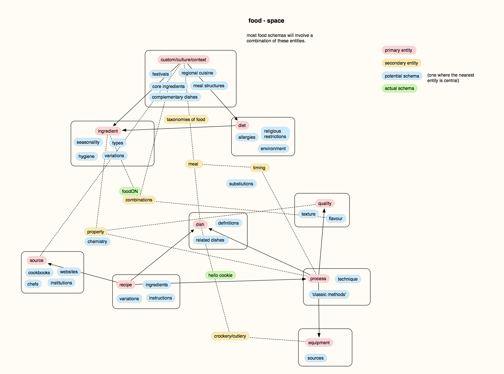
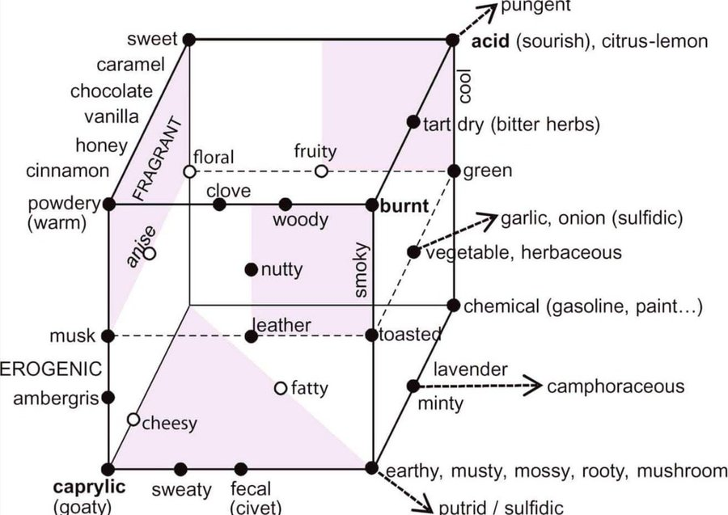

# Underbelly index

This repository is an index and documentation of scripts and datasets associated with the Underbelly project. A README in each folder details links to external relevant datasets, and contains datasets composed for this project specifically, and the scripts use to produce them. This folder is currently internal, as it references projects and datasets that are yet to be released, or are subject to licensing difficulties. A public-facing version that omits these can also be made.

This top-level README describes the intent of the project, and the broad intention behind each thematic collection of datasets. 

## An index for food data

This project is based on a Question-Answering scenario that requires a knowledge base with general knowledge about food and cookery. In order to adequately address a range of questions, a number of thematic topics requiring data have been identified. A diagram showing the interaction between these relationships is shown below.

For a set of earlier notes, links and thoughts on the project, the [R1 Potluck](https://underlay.pubpub.org/pub/f34wfzv0/draft) document contains a longer discussion of these topics.

## Topics
each of these might have multiple sub-collections

* [Recipes](./recipes)
* [Ingredients](./ingredients)
* [Substitutions](./substitutions)
* [Dishes](./dishes) -- Distinguished from recipes -- recipes are the methods used to make dishes, dishes are named and indentifiable entities + don't require recipes. There can be multiple recipes for one dish, etc.
* Processes *(not currently implemented)*
* Sources *(not currently implemented)* -- Chefs, authors, historic entities, institutions, websites etc. All of the information surrounding authorship/origin of specific food, food history.
* Ontologies *(not currently implemented)* --Different ways of organising/ordering/dividing foods/cooking processes, schema-schemas, e.g.
	* Lévi-Strauss [Culinary Triangle](https://en.wikipedia.org/wiki/Culinary_triangle) (roasted/smoked/boiled)
	* a [Bengali traditional classification](https://www.sahapedia.org/our-food-their-food-historical-overview-of-the-bengali-platter) (food that is chewed/sucked/licked/drunk)
	* Patrick Gunkel's [application of sausage-like packaging to non-meat food](http://ideonomy.mit.edu/mapsandlists-set1/pic030.html)
* [Qualities](./quailities) -- Flavours, textures, smells, chemical properties etc
	
* Customs and diets *(not currently implemented)* -- Datasets of what's eaten / not eaten around religious festivals, different diets, 

## Acquiring food data

This [planning document](https://docs.google.com/document/d/19hgyiGOLv-phFP9_WSznHAlesQ1EAPeSjfLXYy489I8/edit#) for Underbelly was originally produced in the context of recipes primarily, but its outline of steps can be more generally applied. In brief:

* Search: identify sources, including existing datasets
* Schematise: define the form that the new dataset will take
* ↱ Parse ↴: scrape new data/ translate existing data
* Reconcile: link to existing ontologies
* Collect: bundle into a collection
* Query: test different queries on the collection
* Transform and Export
* Test and Validate

Each folder's README contains some discussion as to what stage of this pipeline process the datasets are currently at (with information such as scripts and schemas attached if possible).

## Other Combined approaches

Hello Cookie -- getting recipe and process

